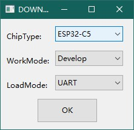
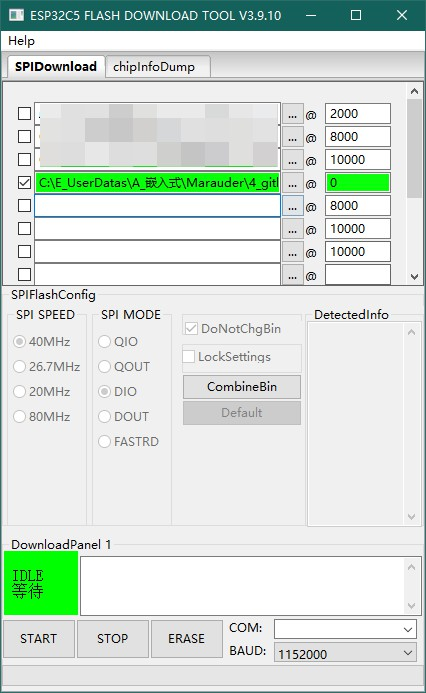

> [!IMPORTANT]
> 再次声明：设备仅用作专业人员的合法技术学习和分析测试（你最好知道你自己在干什么）。

### 固件烧录及调试说明：
**1、连接电脑**
设备板载了CH340芯片，并且使用的是USB的电源，所以无论开机还是关机，只要你将设备通过USB线连接到电脑，将会出现新的COM设备，通过COM口可以进行程序开发，烧录，调试等功能。如果你的电脑没有出现COM设备，首先检查你的数据线是否具备数据传输功能，然后检查电脑是否已经安装了CH340的驱动程序。

这是CH340的驱动下载链接：[Driver](https://www.wch-ic.com/downloads/CH341SER_ZIP.html)

**2、程序烧录**
你可以通过ESP32的烧录工具进行固件的烧录，首先准备好你需要的固件。然后打开ESP32DownloadTool。

ChipType选择ESP32C5,其余选项保持默认。

在上面的固件选择框里选择目录下的“firmware.factory.bin”文件。将右边的地址设置为0。

> [!TIP]
> 这里与英文固件不同，将所有bin文件都集成到一个bin内，所以只需要烧录一个文件。

在右下角COM口选择刚刚出现的新COM口。
在右下角的BAUD选择最大的波特率，一定要选择最大的（这很重要）。

这是ESP32DownloadTool的下载链接：[DownloadTool](https://docs.espressif.com/projects/esp-test-tools/en/latest/esp32/production_stage/tools/flash_download_tool.html)

先让设备保持在关机状态，点击ESP32DownloadTool的“START”，程序会处于等待状态，这个时候按一次设备电源按键，然后自动开始烧录，大概耗时10秒钟。

烧录完成后，断开USB，关机，然后再开机，即可运行刚刚烧录的固件。
