Welcome, and thank you for your support.

This document is intended to help advanced users and hardware enthusiasts with research and technical discussions. It is primarily written for users of the **Developer Board** version. By following this guide, you will be able to assemble your Developer Board and gain a clear understanding of its hardware design.

It is recommended that you read through the entire guide first to familiarize yourself with the assembly process and its difficulty before beginning.

> [!TIP]
> By choosing this kit, I assume that you already have some hands-on experience and technical knowledge. Therefore, the following sections focus primarily on the technical aspects rather than basic assembly skills.

### Before You Begin Assembly

1. Assembly involves certain risks. Please read this guide carefully and make sure you have a soldering iron and steady hands.
2. The entire process requires practical skills. Before you begin, make sure you are confident that you can complete the assembly successfully. Avoid damaging your device. Any damage caused by improper operation is your own responsibility.
3. Make sure your 3D printer's build plate is clean and has good adhesion. Printing the front shell with embossed text requires excellent first-layer adhesion. (When I printed the first prototypes, a dirty build plate caused many failed prints.)

### 3D Printing

You can print the enclosure you need from the [Shell_Model](../Shell_Model) directory. The folder with the highest version number contains the latest design.

### Assembly Instructions

> [!TIP]
> Before handling the PCB, touch a grounded metal object nearby or wear an anti-static wrist strap to prevent electrostatic discharge (ESD) from damaging the board.

**1. Install the Heat-Set Inserts**

Take the four included heat-set brass inserts. Heat them using a soldering iron or another suitable heat source, then press them into the four mounting holes in the enclosure.

The inserts must **not protrude above** the surrounding surface. This means they should be fully pressed into the plastic, or even slightly deeper.

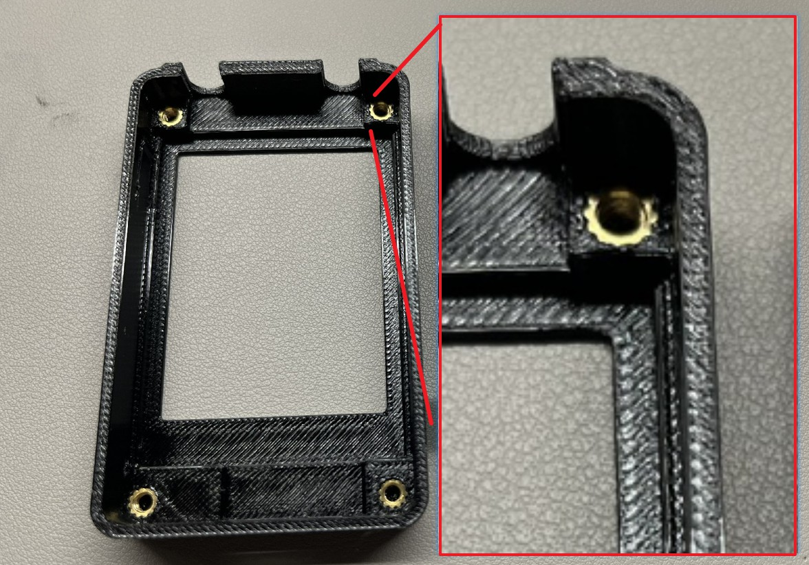

On the side of the enclosure, there are three small windows for the status LEDs. It is recommended to fill these openings with a small amount of white or transparent glue, or even melted plastic. Their purpose is simply to keep dust out.

**2. Install the PCB**

Insert the USB connector side into the enclosure first, then gently press down the antenna side until the PCB is fully seated.

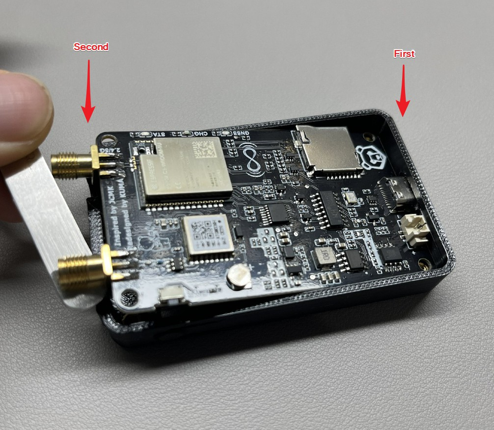

**3. Install the Battery**

You will need to provide your own battery. The recommended specifications are:

| Item | Specification | Acceptable Range |
|--------------|---------|---------|
| **Dimensions** | 60 × 40 × 6.5 mm | The battery should be smaller than or close to the recommended dimensions in order to fit inside the enclosure. |
| **Capacity** | Approximately 2000 mAh | Use a battery with **at least 2000 mAh** capacity for safe charging operation. |
| **Connector** | JST 1.25 mm, 2-pin |

***Battery Capacity***

The PCB is configured with a maximum charging current of **1 A**. Most lithium batteries recommend a charging current of approximately **0.5C**, so a battery capacity of at least **2000 mAh** is recommended.

If you choose a smaller battery, you **must** reduce the charging current to ensure safe operation.

See the appendix: [Charging Current](#appendix-charging-current)

***Battery Mounting***

You can use thin double-sided adhesive tape to secure the battery inside the enclosure.

***Battery Connection***

If you cannot use a JST 1.25 connector, you may solder the battery directly to the PCB.

**Be extremely careful with the polarity.** The board does **not** include reverse-polarity protection, so you must ensure the positive and negative terminals are connected correctly.

Optionally, you may also solder a backup battery for the GNSS positioning module. Installing the backup battery can reduce the time required for satellite acquisition after power-up, but it is **not required**. Whether to install it depends on your own needs.

The backup battery model is **ML414H-IV01E**.

The schematic and installation location are shown below:

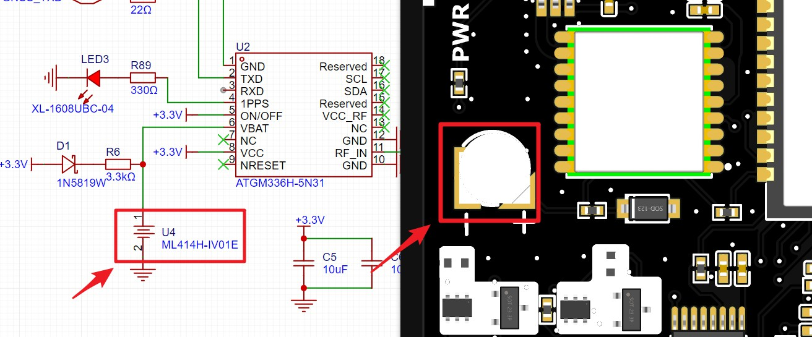

**4. Final Assembly**

Use the four included screws to fasten the rear cover.

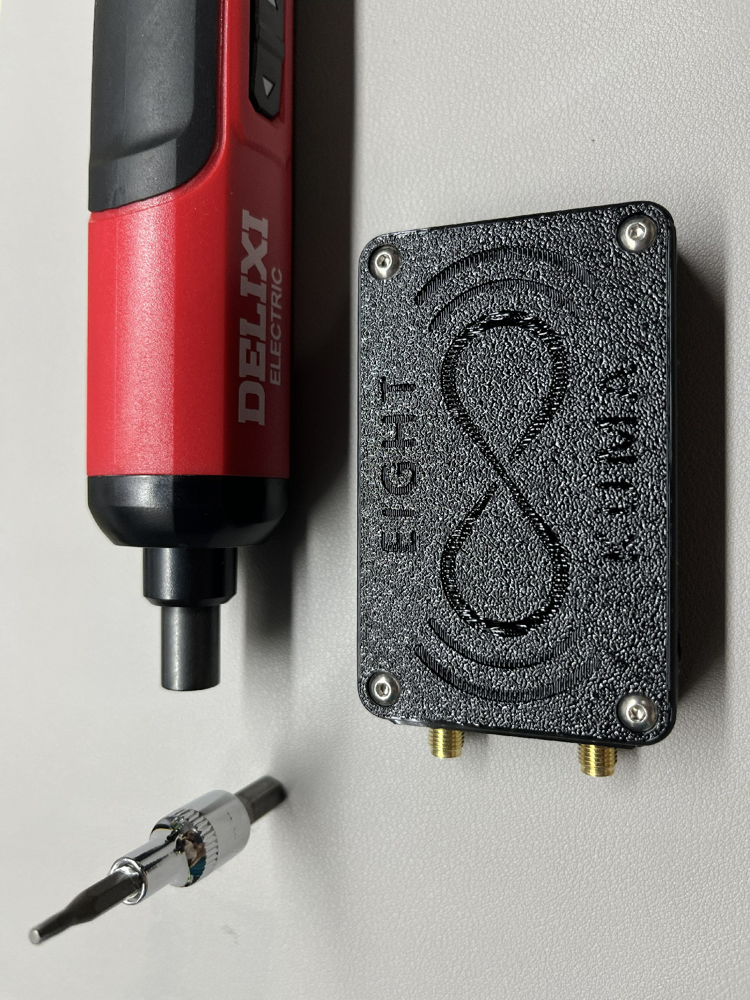

Finally, thread the included lanyard through the hole at the lower-right corner of the enclosure for more convenient carrying.

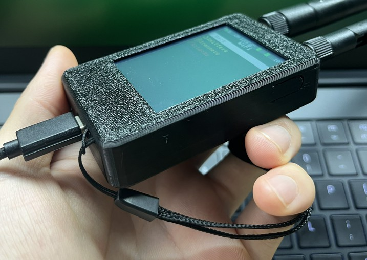

### Firmware Flashing and Debugging Guide:

**1. Connect to the Computer**

The device is equipped with a CH340 chip and uses USB power. Therefore, regardless of whether the device is powered on or off, once you connect the device to a computer via a USB cable, a new COM port will appear. Through this COM port, you can perform firmware development, flashing, debugging, and other operations.

If no COM port appears on your computer, first check whether your USB cable supports data transmission. Then check whether the CH340 driver has been installed correctly.

You can download the CH340 driver here: [Driver](https://www.wch-ic.com/downloads/CH341SER_ZIP.html)

**2. Prepare the Flashing Tool**

You can use the official flashing tool provided by ESP32 for firmware flashing, or use other software with similar functions. In this guide, I will demonstrate using the official tool.

First, prepare **ESP32DownloadTool**.

You can download ESP32DownloadTool here: [DownloadTool](https://docs.espressif.com/projects/esp-test-tools/en/latest/esp32/production_stage/tools/flash_download_tool.html)

Then prepare the firmware you want to flash.

The **EIGHT** device is compatible with the **Marauder V8 firmware** developed by JustCallMekoko.

[Marauder V8 Firmware](https://github.com/justcallmekoko/ESP32Marauder)

At the same time, we are also working on a Chinese translation based on this firmware. You can find the latest Chinese firmware here:

[Chinese Firmware](./Chinese_Firmware)

After opening ESP32DownloadTool, select **ESP32C5** as the **ChipType**, and keep all other options at their default settings.

In the firmware selection area above, select the required files such as **bootloader**, **firmware**, etc., and configure their corresponding addresses.

In the bottom-right corner, select the newly appeared COM port.

In the bottom-right corner, set the **BAUD** rate to the maximum value. Make sure to select the highest baud rate (this is important).

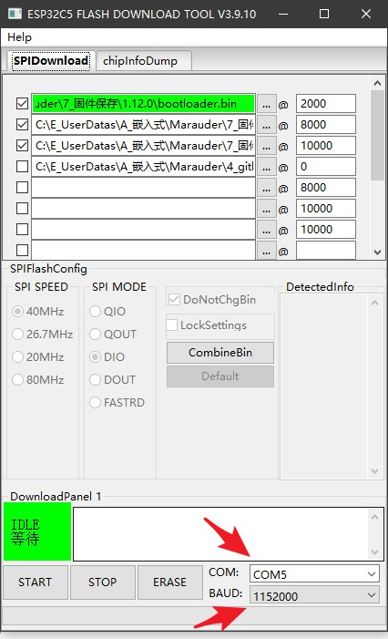

**3. Flashing the Firmware**

Please note: the device must remain powered off before starting.

First, click the **"START"** button in ESP32DownloadTool. The status will change to **"SYNC"**.

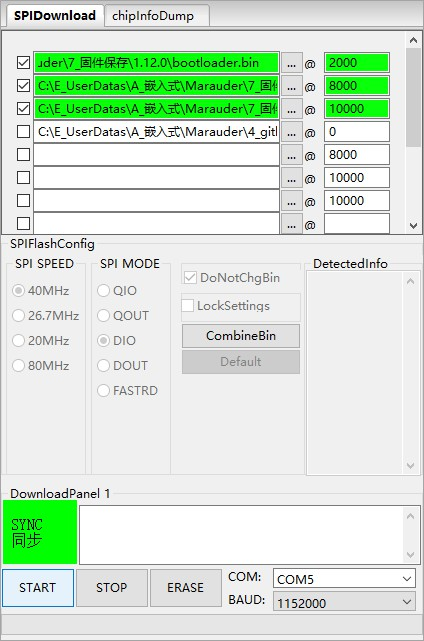

At this moment, power on the device. The program will automatically detect the device and start flashing the firmware.

The flashing process takes approximately 10 seconds. After completion, the status will display **FINISH**.

  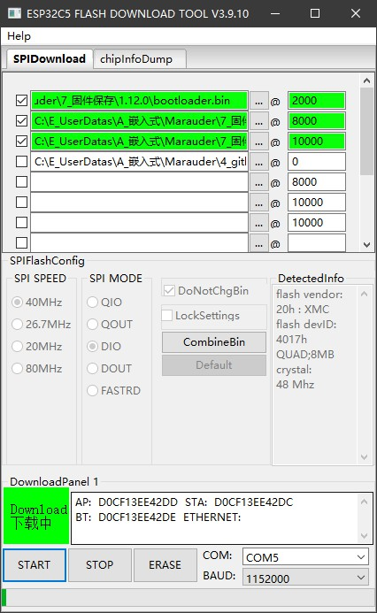
  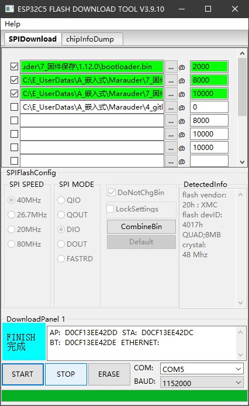

After confirming that the flashing process is complete, click **"STOP"**.

Then disconnect the USB cable, power off the device, and power it on again. The newly flashed firmware will now start running.

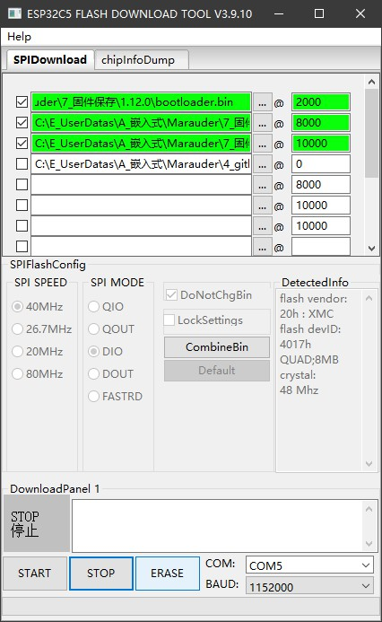

> [!WARNING]
> During the device startup process, do not connect the device to a computer. Otherwise, the device may enter download mode instead of running the internal user firmware.

### Appendix: Charging Current

To adjust the charging current, refer to the schematic and image below.

The maximum charging current is determined by **R35**, using the following formula:

**I(bat) = 1000 / R35**

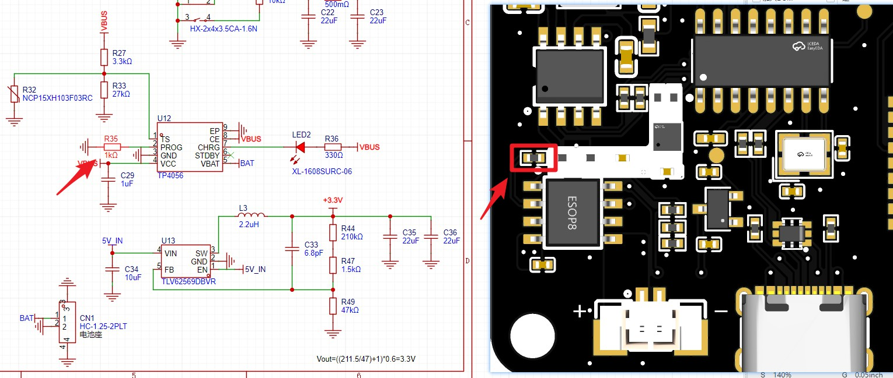