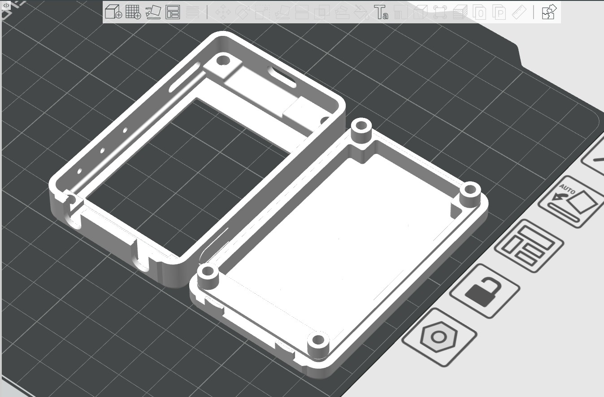
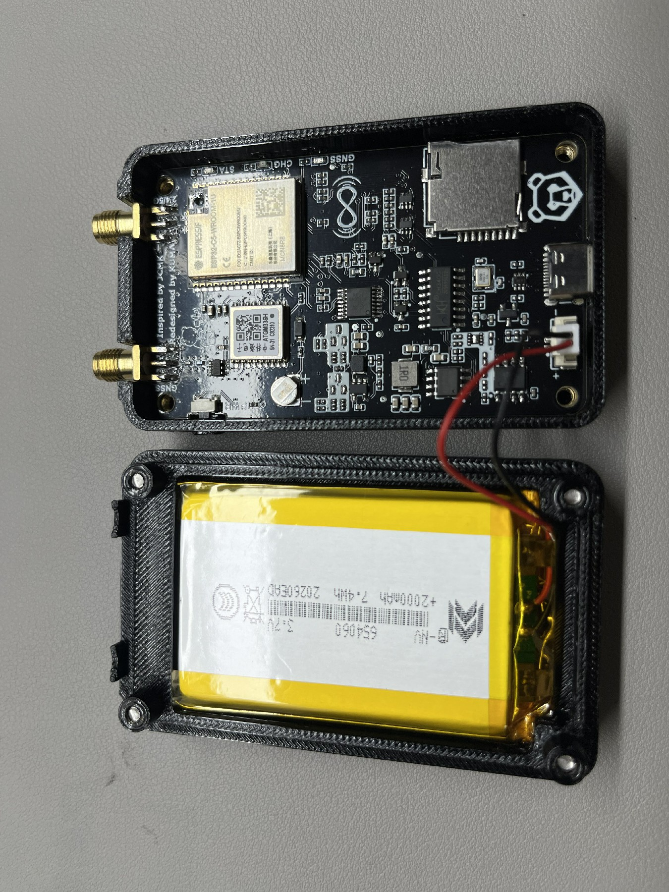
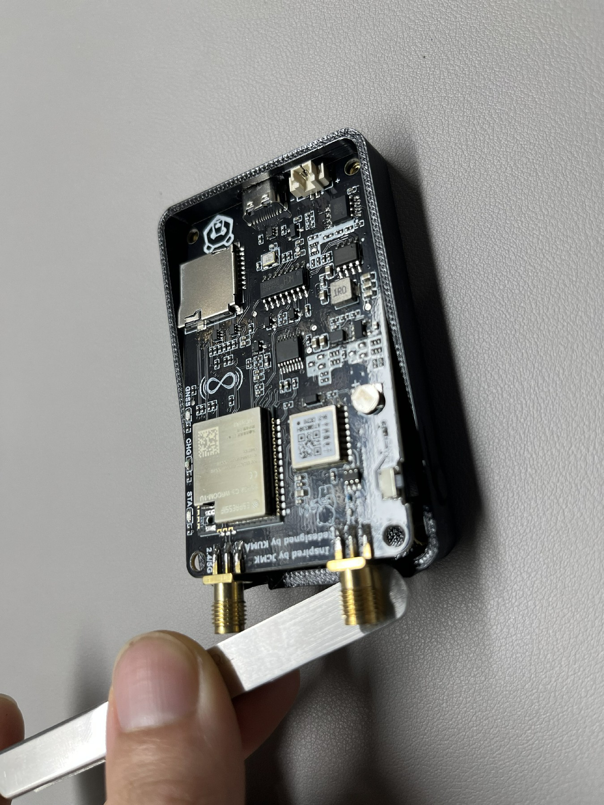
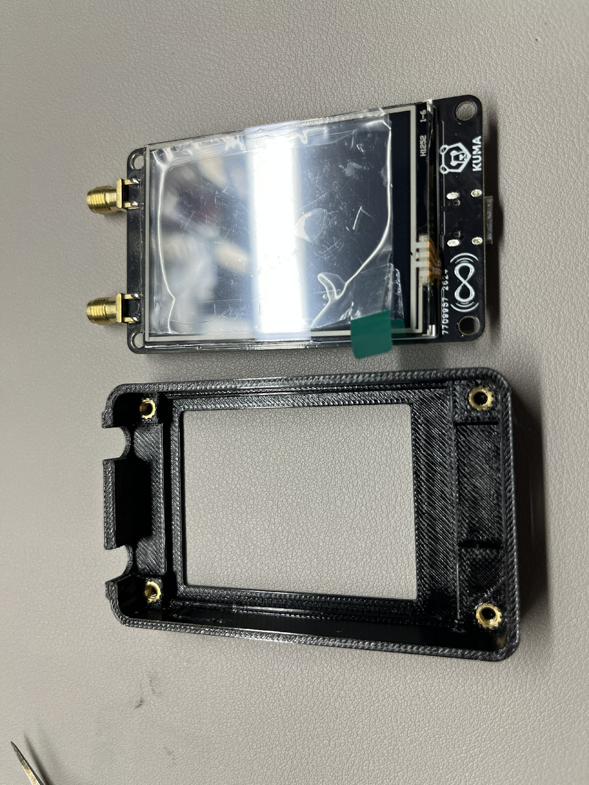
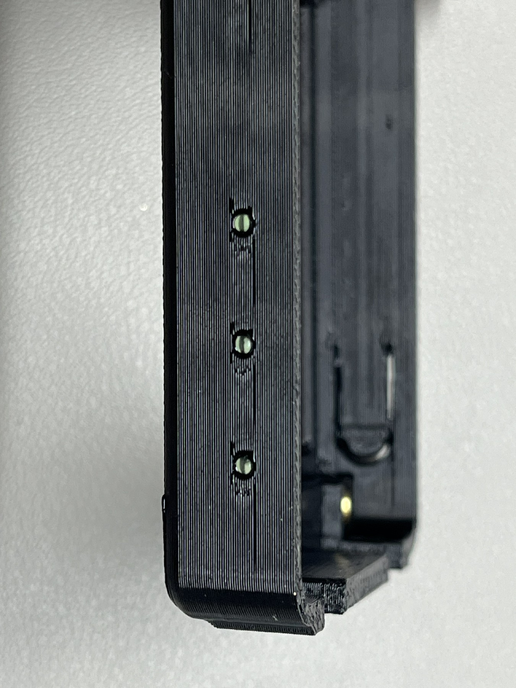

欢迎来到这里，感谢大家支持，如果你有一台3D打印机，现在你可以为自己打印更漂亮⭐更具个人特色😎的外壳!并且如果你有足够的时间，可以选择更精细的打印精度。

我在打印时使用了PETG材料，如果打印机设置正确的话，打印效果还算不错。

> [!WARNING]
> 警告，拆卸壳体有可能损坏设备，你需要自己承担后果。

### 开始打印自己的外壳前，你需要知道：
1、拆装有风险，请仔细阅读说明，并且确保你有一个电烙铁和灵活的双手。
2、更换和安装外壳需要一定的动手能力，开始之前确定你可以搞定，不要弄坏你的设备，因为拆卸导致的后果，由你自己承担。
3、确保3D打印机的打印板干净，富有粘性，因为打印正面的文字的时候，对打印板有较高的要求（我最初打印的时候因为打印板不够干净，粘性较差，失败了很多次）。
4、做好心理准备，内部由于是手工组装焊接的，所以有可能会有手工的痕迹~（还要什么自行车:roll_eyes:~）

### 3D打印说明：
你可以通过[Shell_Modell](././Shell_Model)目录来打印你所需要的外壳，最大的数字代表最新的版本。

### 拆卸及组装说明：

> [!TIP]
> 拆卸之前，你可以触摸附近的接地金属，或者使用静电手环，避免静电损坏电路板。

**1、拆掉顶壳**
在设备背面，你可以看到非常明显的4个螺丝，使用螺丝刀将其拆掉。

然后你会看到设备的内部电路板。

**2、断开连接线**
拔掉电池连接线，然后记得一定要拆除tf卡。

**3、拿出主板**
从天线插口一侧将电路板向上抬起来。然后就可以取出电路板了。

**4、取出其他配件**
设备外壳还有4个金属的热熔螺母，如果你需要在新的壳子上继续使用的它，那么也需要拆下来，使用电烙铁等工具加热后撬出来。

还有最后一个东西，在设备侧面有3个指示灯的孔，我使用了一些小型玻璃珠来充当“窗口”，你可以选择循环利用他们，在拆除和安装的或者中，只需要稍微加热这些玻璃珠。

不过因为玻璃珠特别小，操作难度大。建议你使用一些白色或透明的胶水替代，甚至是塑料填充这些孔洞即可。

**5、最后一步**
现在，把这些步骤再反向重复一遍，装回到新的壳体里。